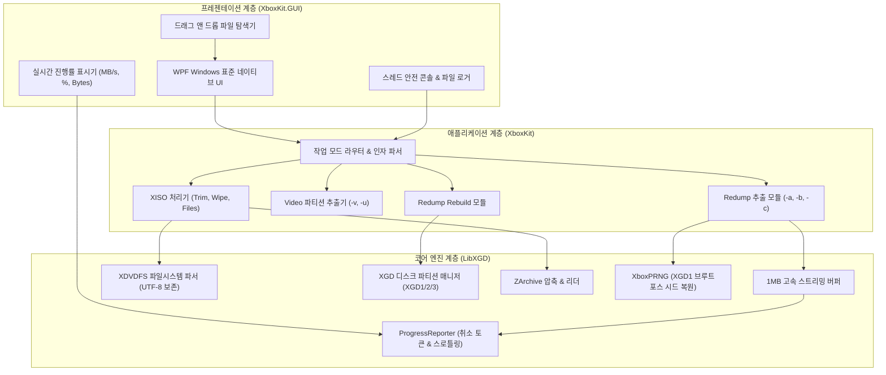

# XboxKit (with Windows GUI)

[](https://github.com/RR-korea/XboxKit)
[](https://github.com/RR-korea/XboxKit)
[](https://dotnet.microsoft.com/)
[](https://github.com/RR-korea/XboxKit)
[](LICENSE.txt)


**XboxKit**은 오리지널 Xbox(XGD1) 및 Xbox 360(XGD2 / XGD3) 디스크 이미지의 완벽한 보존(Archival)과 에뮬레이터 구동(Playable)을 위해 설계된 **무손실 양방향 변환 및 복원(Rebuild) 툴킷**입니다.

기존 콘솔 기반 도구에 **현대적인 윈도우 표준 WPF GUI(독립형 단일 실행 파일 `XboxKit-GUI.exe`)**를 결합하여, 번거로운 명령줄 입력 없이 드래그 앤 드롭과 원클릭 프리셋만으로 디스크 이미지를 분석, 변환, 복원할 수 있습니다.

---

## 🖥️ 윈도우 표준 GUI (`XboxKit-GUI.exe`) 주요 특징

- **단일 독립형 실행 파일 (Standalone Single-File EXE)**:
  - .NET 런타임이나 외부 라이브러리 설치가 전혀 필요 없는 순수 64비트 단일 실행 파일로 즉시 실행됩니다.
- **직관적인 탭 기반 인터페이스**:
  - **[추출 및 변환]**: 원본 Redump ISO를 에뮬레이터용 XISO, 보조 파일, ZArchive 압축본으로 변환.
  - **[원본 복원 (Rebuild)]**: 트리밍된 XISO와 보조 파일들을 결합하여 원본 Redump ISO로 비트 퍼펙트 복원.
- **원클릭 프리셋 (One-Click Presets)**:
  - 🎮 **에뮬레이터 최적화 (-b)**: 빈 공간(랜덤 패딩)을 제거하고 여백을 트리밍하여 최소 용량으로 고속 변환.
  - 📦 **무손실 전체 백업 (-a)**: XISO, Video ISO, Filler(패딩), Seed(시드), 시스템 업데이트를 일괄 추출하여 영구 보존.
  - 🗜️ **ZArchive 무손실 압축 (-c)**: 에뮬레이터에서 직접 압축 해제 없이 로드 가능한 초고압축 `.zar` 생성.
  - ⚙️ **사용자 지정 옵션**: 트림, 와이프, 비디오 추출, 파일시스템 추출 등 세부 옵션 개별 선택 가능.
- **🔍 원클릭 사전 분석 및 정밀 유효성 진단**:
  - 실제 디스크 쓰기 전 디스크 규격(XGD1/XGD2/XGD3), 파티션 오프셋, XDVDFS 파일시스템 무결성, 폴더 내 보조 파일 유무를 사전 판별하여 작업 실수를 예방합니다.
- **⚡ 1MB 스트리밍 I/O 및 실시간 전송 속도 표시**:
  - 1MB 단위의 고속 스트리밍 버퍼와 함께 실시간 진행 퍼센트(%), 현재/총 용량(GB), 전송 속도(MB/s)를 150ms 단위로 계산하여 멈춤 없이 쾌적하게 보여줍니다.
- **🛑 즉각적인 작업 취소 (Cancel)**:
  - 수 기가바이트 처리 중에도 `[■ 취소]` 버튼을 누르면 즉시 안전하게 I/O를 중단하고 임시 파일을 정리합니다.
- **🌐 한국어/일본어 및 CJK 유니코드 완벽 지원**:
  - 모든 파일시스템 디코딩과 경로 처리에 UTF-8을 적용하여, 한글/일본어/특수문자가 포함된 경로와 파일명도 물음표(`?`) 깨짐 없이 100% 보존합니다.
- **📁 세션 로그 자동 기록 및 비정상 종료 원천 방어**:
  - 실행 시마다 `logs/` 디렉터리에 타임스탬프 기반 세션 로그를 기록하며, 전역 예외 처리기로 충돌(크래시)을 원천 차단합니다.

---

## 🏗️ 시스템 아키텍처 (Architecture)

XboxKit은 모듈화된 3계층 아키텍처로 구현되어 있으며, GUI 인터페이스와 저수준 디스크 I/O 엔진이 완벽히 분리되어 동작합니다.



---

## 💿 Xbox 디스크 규격 상세 매트릭스

XboxKit은 마이크로소프트의 역대 모든 광디스크 규격을 완벽하게 지원합니다:

| 디스크 규격 | 지원 콘솔 | 전체 Redump ISO 크기 | 게임 파티션(XISO) 시작 오프셋 | 게임 파티션 크기 | 비디오 파티션(Wave) |
| :--- | :--- | :--- | :--- | :--- | :--- |
| **XGD1** | Original Xbox | 7,825,162,240 바이트 (7.28 GB) | `0x18300000` (약 387 MB) | 7,027,245,056 바이트 (6.54 GB) | 단일 표준 규격 |
| **XGD2** | Xbox 360 (초·중기형) | 7,838,695,424 바이트 (7.30 GB) | `0x0FD90000` (약 253 MB) | 7,307,067,392 바이트 (6.80 GB) | Wave 0 ~ Wave 20 |
| **XGD2-Hybrid** | Xbox 360 (복합형) | 7,836,663,808 바이트 (7.30 GB) | `0x89D80000` (약 2.20 GB) | 3,213,426,688 바이트 (2.99 GB) | 특수 규격 |
| **XGD3** | Xbox 360 (후기형 8GB 디스크) | 8,738,848,768 바이트 (8.14 GB) | `0x02080000` (약 32 MB) | 8,662,384,640 바이트 (8.06 GB) | Wave 21+ (고유 갱신) |

---

## 🚀 빌드 및 실행 가이드

### 1. 단일 실행 파일 원클릭 빌드 (`build.ps1`)
프로젝트 루트에서 제공되는 통합 빌드 스크립트를 실행하면 버전이 0.0.1 단위로 자동 증가하며, 단일 실행 파일 빌드, 최신 스크린샷 캡처 및 Git Push가 한 번에 수행됩니다.

```powershell
# GitHub Push를 포함한 전체 빌드 파이프라인
.\build.ps1 -Token "YOUR_GITHUB_PAT"

# 로컬 단일 exe 빌드만 수행할 때
.\build.ps1 -NoPush
```

### 2. 수동 dotnet CLI 빌드
```bash
dotnet publish XboxKit.GUI/XboxKit.GUI.csproj -c Release -r win-x64 --self-contained true /p:PublishSingleFile=true /p:EnableCompressionInSingleFile=true -o publish
```
빌드 완료 시 `publish/XboxKit-GUI.exe` 단일 파일이 생성됩니다.

---

## ⌨️ CLI (명령줄) 사용법

```
Rebuild mode: 옵션 없이 실행 (입력 파일들을 결합하여 Redump ISO 복원)
Usage: xboxkit.exe <input.xiso> [보조파일들...]

Extract mode: 하나 이상의 옵션과 함께 실행 (입력 파일을 분할/변환)
Usage: xboxkit.exe [options] <input.iso>

Batch 옵션 (Redump ISO 대상):
  -a, --all       무손실 전체 추출 (-rstuvwx)
  -b, --best      에뮬레이터 최적화 XISO 생성 (-twx) [추천]
  -c, --compress  ZArchive 무손실 압축 (-puvz)

개별 옵션:
  -n, --no        경고 시 무조건 중단, 덮어쓰지 않음
  -o, --output    XISO 내부의 게임 파일들을 폴더로 직접 추출
  -p, --petrify   스켈레톤 XISO 추출 (게임 파일 내용 0으로 채움)
  -q, --quiet     콘솔 안내 메시지 숨김
  -r, --random    무작위 필러 데이터를 별도 파일로 추출
  -s, --seed      XGD1 필러 생성에 사용된 난수 시드 추출
  -t, --trim      XISO 게임 파티션 뒷부분 자르기 (트림)
  -u, --update    비디오 ISO에서 시스템 업데이트 파일 분리 (XGD3 전용)
  -v, --video     비디오 파티션을 비디오 ISO로 추출
  -w, --wipe      XISO 내부의 무작위 필러 데이터를 0으로 정리
  -x, --xiso      XDVDFS 게임 파티션 ISO 추출
  -y, --yes       확인 대화상자 없이 항상 덮어쓰기 허용
  -z, --zar       게임 파일들의 ZArchive(.zar) 생성
```

---

## 📜 라이선스 (License)

본 프로젝트는 [MIT 라이선스](LICENSE.txt) 하에 배포됩니다.
Copyright (c) Deterous 2024-2026. GUI & Enhanced Architecture by RR-korea.
