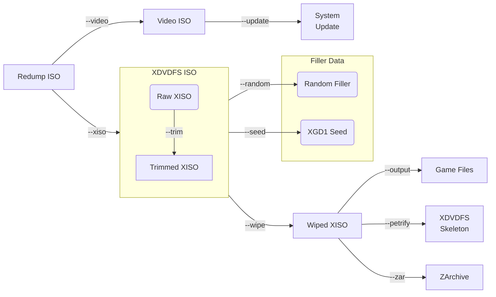

# XboxKit (with Windows GUI)


**XboxKit** losslessly converts between Xbox / Xbox 360 disc image formats for archival and collection purposes. It supports Redump ISOs, XISO ([XDVDFS](https://multimedia.cx/xdvdfs.html) format) images of the game partition, video ISO (DVD-Video format) images of the video partition, extracted random filler padding data, XGD1 filler seeds, system update files (from XGD3 video ISOs), XISO skeletons, ZAR ([ZArchive](https://github.com/Exzap/ZArchive)), and individual game files.

## 🖥️ Windows GUI (`XboxKit-GUI.exe`)

A native Windows standard GUI is now included as a standalone, single-file executable:

- **Single Executable**: Completely self-contained single `.exe` file without needing to install .NET runtimes.
- **Drag & Drop**: Drag and drop ISO or XISO files directly onto the window.
- **One-Click Presets**:
  - 🎮 **Emulator Optimized (-b)**: Trimmed and wiped XISO for minimal size and maximum emulator compatibility.
  - 📦 **Full Lossless Archive (-a)**: Extract all data components (XISO, Video ISO, random filler, seed, system update) for full lossless archival.
  - 🗜️ **ZArchive Compression (-c)**: Compress game files into `.zar` format with skeleton XISO.
  - ⚙️ **Custom Options**: Granular checkboxes for each operation.
- **Rebuild Mode**: Seamlessly reconstruct original Redump ISOs by combining XISO and secondary files.
- **CJK & Unicode Support**: Full UTF-8 multi-language encoding support for Korean (한국어), Japanese (日本語), and Unicode paths/filenames.

### Building the GUI executable

```bash
dotnet publish XboxKit.GUI/XboxKit.GUI.csproj -c Release -r win-x64 --self-contained true /p:PublishSingleFile=true /p:EnableCompressionInSingleFile=true -o publish
```
The output `publish/XboxKit-GUI.exe` is a standalone executable.




## Command-line help text

```
Rebuild mode: Don't use any options (combines input files)
Usage: xboxkit.exe <input.xiso> [files...]

Extract mode: Use one or more options (splits input file)
Usage: xboxkit.exe [options] <input.iso>

Batch options (for redump ISO):
  -a, --all       All options for lossless XISO extraction (-rstuvwx)
  -b, --best      Create trimmed/wiped XISO only (-twx)
  -c, --compress  Options for lossless ZArchive compression (-puvz)

Manual options:
  -n, --no        Assume no (stops at warnings, never overwrites)
  -o, --output    Outputs the game files from the XISO
  -p, --petrify   Extracts XDVDFS skeleton (XISO with zeroed files)
  -q, --quiet     Don't print INFO messages to console
  -r, --random    Extracts random filler data to a separate file
  -s, --seed      Extracts RNG seed used for XGD1 filler
  -t, --trim      Trims end of XISO (game partition)
  -u, --update    Extracts update file from video ISO (XGD3 only)
  -v, --video     Extracts video ISO (video partition)
  -w, --wipe      Wipes random filler data in XISO
  -x, --xiso      Extracts XDVDFS ISO (game partition)
  -y, --yes       Assume yes (ignores warnings, always overwrites)
  -z, --zar       Creates ZArchive of game files
```

**Note**: Extracting the system update (su20076000_00000000) is useful for XGD3 discs as deduplication of the XGD3 video ISOs is not possible unlike XGD1/XGD2 (the video partition is unique for each XGD3 disc). When extracting the update, XboxKit zeroes the update file within the video ISO so that it becomes highly compressible (deduplication of the system update file is then possible across multiple XGD3 disc images). XboxKit will ignore the `-u` option when used with XGD1/XGD2 inputs, as they do not have system update files in the video partition.

## Example usage

'''Note''': Rebuilding Redump ISO from loose game files or a ZAR is documented but not yet complete, this will be implemented in a future update (at least in the future v1.0 release). ZArchive creation is currently one-way.

For lossless conversion from a redump ISO to an XISO, run:
`./xboxkit.exe -a game.iso`

Outputs:
- game.xiso (Useable by emulators, smaller, and compresses well)
- game.video.iso (Video partition, shared by similar discs with the same "wave")
- game.filler (Random padding filler data, needed for lossless conversion)
- game.seed (Initial seed used to generate early XGD1 disc random filler data)
- su20076000_00000000 (System update file for XGD3 only, shared by similar discs)

Losslessly converting back to the original redump ISO:
`./xboxkit.exe game.xiso`
(requires all the original output files).

Best options for only conversion to XISO (trims the XISO and wipes the random filler data):
`./xboxkit.exe -b game.iso`

Outputs:
- game.xiso (Usable by emulators, smaller, and compresses well)

Losslessly converting from a redump ISO or XISO to a ZArchive of the game files:
`./xboxkit.exe -c game.iso`

Outputs:
- game.skeleton.xiso (XISO with all game files zeroed)
- game.hash (Integrity hashes of the game files)
- game.video.iso (Video partition, shared by similar discs with the same "wave")
- su20076000_00000000 (System update file for XGD3 only, shared by similar discs)
- game.zar (Zstd compressed archive of game files, usable by some emulators)

Losslessly converting back to the original redump ISO:
`./xboxkit.exe game.zar`
(requires all the original output files).

If you have renamed the output files, you can explicitly give the paths for rebuilding the redump ISO:
`./xboxkit.exe game.xiso example.video.iso example.filler su20076000_00000000`
(replace example.filler with example.seed if applicable)

For more info on using the program options, run `./xboxkit.exe --help`

# Technical Notes

### Purpose

XboxKit was developed as a tool for two-way lossless conversion between large collections of redump-style Xbox & Xbox 360 ISOs and compressed playable formats such as XISO and ZAR. This achieves the balance of archival quality and compressed playable formats, by storing the auxiliary data in sidecar files that can be managed, datted, and stored separately (with deduplication and compression). These sidecar files (such as the filler data, skeleton, and file hashes) do not contain any copyright data, and can be safely shared publicly to allow people with their own backups to confirm their files are not corrupted and repair them to match redump hashes. XboxKit therefore makes it possible for someone with only a backup of the loose game files to rebuild to an redump ISO for archival purposes.

### Xbox Filesystem

The Xbox DVD filesystem (XDVDFS) is a custom filesystem used in Xbox and Xbox 360 DVDs. The volume descriptor is stored at offset 0x10000 (32nd sector) and begins and ends with `MICROSOFT*XBOX*MEDIA`. On XGD1/XGD2 discs, it is followed by another metadata sector that begins with `XBOX_DVD_LAYOUT_TOOL_SIG`. The volume descriptor points to a root directory descriptor, which contains a binary tree of directories and files. On Xbox and Xbox 360 discs, the gaps between file extents are filled with a stream of pseudo-randomly generated bytes (referred to in XboxKit as random filler data). These bytes can be extracted (`--random` option), to make the XISO more compressible. For some early manufactured XGD1 (Original Xbox) discs, the pseudo-random number generator algorithm is simpler and the seed to generate the bytes can be brute forced (`--seed` option). XboxKit also supports storing the XISO filesystem as a skeleton (`--petrify` option) which can be stored separately to the game files, allowing for lossless conversion between the loose files and the original XISO (and with the video ISO, conversion back to the redump ISO).

### Xbox Discs

Xbox & Xbox 360 DVDs (commonly referred to as XGDs) are not physically different from other dual-layer DVDs (DVD-9). A few tweaks to the disc's data format hides the game partition from standard DVD drives. Custom disc drive firmware is required to read the entirety of the disc, such as [OmniDrive](https://github.com/RibShark/OmniDrive) or [Kreon](http://wiki.redump.org/index.php?title=Optical_Disc_Drive_Compatibility:_Xbox_(original)_%26_Xbox_360) firmware. [Redumper](https://github.com/superg/redumper) supports these custom firmware drives and can write to a Redump-style ISO (both video and game partitions combined).

The DVD's PFI[^1] sector indicates to the drive that the DVD's layerbreak[^2] is after the first portion of the video partition[^3]. The [Security Sector](https://github.com/Deterous/ParseXboxMetadata) (SS)[^4] is what is read by Xbox disc drives and instead points to the game partition of the disc, with the true layerbreak value. Redump-style ISOs aim to preserve the entire disc by combining both the video and game partitions into a single ISO file (merging the PFI and SS descriptors[^5]). XISO files instead represent only the game partition pointed to by the SS (removing both the video partition and the middle zones between the partition on both layers). The XISO file uses the Xbox filesystem (commonly referred to as XDVDFS) that is not readable by Windows. Other programs such as [extract-xiso](https://github.com/xboxdev/extract-xiso) recreate the XISO in a lossy manner in order to optimize for file size, while the XISO produced by XboxKit keeps the original XDVDFS filesystem intact.

[^1]: Physical Format Information, a sector in the disc's lead-in describing the disc's data layout.
[^2]: Sector number at which the data switches from being stored on the 1st layer to the 2nd layer.
[^3]: The video partition is physically stored on both layers (split at the PFI's layerbreak). In a redump ISO (and physically on the disc), there exists a gap of zeroed sectors between the end of the first layer's video partition and the start of the first layer's game partition. This is repeated on the second layer, with a gap of zeroed sectors between the end of the game parititon and the start of the video partition on the second layer. XboxKit creates the video partition by joining the data at the start and end of the redump ISO, replicating what a standard DVD drive would read if presented with an Xbox disc.
[^4]: An XGD-specific sector in the lead-out of the DVD that follows the PFI spec, with other data in the reserved bytes. The SS also contains the security sector ranges that are unreadable by disc drives due to intentional mastering errors, and are skipped and left zeroed in the redump ISO. XGD1 (Xbox) has 16 ranges of unreadable sectors within the user data area, while XGD2/XGD3 (Xbox 360) has just two ranges, each range being 4096 sectors long.
[^5]: The PFI descriptor format specifies three values: the start sector number, the layerbreak, and the end sector number. Redump ISO uses the start/end sector number from the PFI (video partition), but the layerbreak value from the SS (game partition). This way, all valid user data sectors are read from the disc including both partitions.
