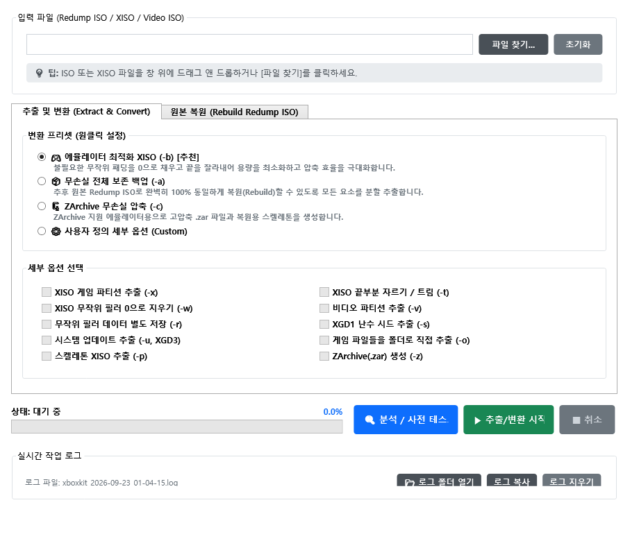
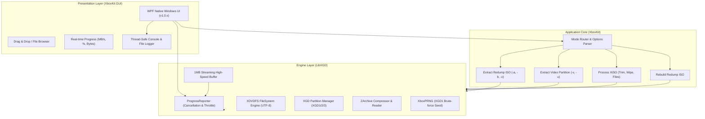

# XboxKit (Xbox / Xbox 360 ISO Toolkit & GUI)

[]()
[](https://dotnet.microsoft.com/)
[]()
[]()
[](https://opensource.org/licenses/MIT)



**XboxKit**?€ Xbox(?ㅻ━吏€?? 諛?Xbox 360 ?붿뒪???대?吏€瑜??꾩뭅?대튃, ?섏쭛, ?먮??덉씠??援щ룞 紐⑹쟻?쇰줈 **100% 臾댁넀??蹂€??諛?蹂듭썝(Rebuild)**?섎뒗 ?ъ씤???꾧뎄?낅땲??

理쒖떊 ?덈룄???쒖? WPF GUI ?명꽣?섏씠??`XboxKit-GUI.exe`), ?ㅼ떆媛??띾룄/吏꾪뻾瑜??쒖떆, 利됯컖 痍⑥냼(Cancel), ?쒓뎅?는룹씪蹂몄뼱 ??CJK ?좊땲肄붾뱶 ?꾨꼍 吏€?? 洹몃━怨?.NET ?고????ㅼ튂媛€ ?꾩슂 ?녿뒗 **?낅┰???⑥씪 ?ㅽ뻾 ?뚯씪(Self-Contained Single-File EXE)**濡??쒓났?⑸땲??

---

## ?룛截??쒖뒪???꾪궎?띿쿂 (Architecture)

XboxKit?€ ??븷蹂꾨줈 ?꾩쟾??遺꾨━??3怨꾩링 ?꾪궎?띿쿂濡?援ъ꽦?섏뼱 ?덉쑝硫? 鍮꾨룞湲?諛깃렇?쇱슫??泥섎━?€ ?ㅻ젅???덉쟾??吏꾪뻾瑜?由ы룷?곕? ?듯빐 UI媛€ 硫덉텛吏€ ?딅뒗 ?곗뼱??諛섏쓳?깆쓣 蹂댁옣?⑸땲??



### ?꾪궎?띿쿂 ?듭떖 ?ㅺ퀎 ?먯튃
1. **?ㅻ젅??遺꾨━ 諛?鍮꾨룞湲??뚯씠?꾨씪??*: 紐⑤뱺 ?붿뒪??I/O?€ 臾닿굅???뚯씪 蹂듭궗??諛깃렇?쇱슫???쒖뒪??`Task.Run`)?먯꽌 ?섑뻾?섎ʼn, UI??150ms ?⑥쐞 Throttling???듯빐 ???놁씠 遺€?쒕윭??60fps 媛깆떊???좎??⑸땲??
2. **利됯컖?곸씤 痍⑥냼(Cancellation Token) 吏€??*: `LibXGD.ProgressReporter`媛€ 1MB I/O 釉붾줉 ?⑥쐞留덈떎 痍⑥냼 ?붿껌??寃€?ы븯?? ?ъ슜?먭? 痍⑥냼 ?대┃ ??0.1珥???利됯컖 ?덉쟾?섍쾶 猷⑦봽瑜??덉텧?섍퀬 ?뚯씪 ?몃뱾???뺣━?⑸땲??
3. **?ㅻ젅???덉쟾??濡쒓퉭(Thread-Safe Logging)**: `Dispatcher.CheckAccess()`瑜?湲곕컲?쇰줈 ???댁쨷 踰꾪띁 濡쒓퉭???곸슜?섏뿬 ?щ줈???ㅻ젅???덉쇅 ?놁씠 ?ㅼ떆媛?濡쒓렇 李쎄낵 ?몄뀡 ?뚯씪(`logs/xboxkit_*.log`)???숈떆 湲곕줉?⑸땲??
4. **?좊땲肄붾뱶/CJK ?⑥쟾 蹂댁〈**: XDVDFS 諛?ZArchive ?붾젆?곕━ ?뷀듃由??붿퐫????UTF-8 ?쒖????곸슜?섏뿬 ?쒓뎅?? ?쇰낯???깆쓽 ?뚯씪紐낃낵 寃쎈줈媛€ ?덈? 源⑥?吏€ ?딆뒿?덈떎.

---

## ?뼢截?二쇱슂 湲곕뒫 (Key Features)

### 1. 吏곴??곸씤 ?덈룄???쒖? GUI
- **?⑥씪 ?ㅽ뻾 ?뚯씪**: 異붽? ?뚰봽?몄썾?대굹 .NET SDK/?고????ㅼ튂 ?놁씠 `XboxKit-GUI.exe` ?섎굹留??ㅽ뻾?섎㈃ 利됱떆 ?숈옉?⑸땲??
- **?쒕옒洹????쒕∼ 吏€??*: ?붿뒪???대?吏€ ?뚯씪??李??꾩뿉 ?뚯뼱???볦쑝硫??뚯씪 ?ш린?€ 洹쒓꺽(XGD1, XGD2, XGD3, Redump ISO, XISO)???먮룞?쇰줈 ?먮퀎?⑸땲??
- **?먰겢由?理쒖쟻???꾨━??*:
  - ?렜 **?먮??덉씠??理쒖쟻??XISO (-b) [異붿쿇]**: 臾댁옉???⑤뵫(?꾨윭)??0?쇰줈 吏€?곌퀬 ?앹쓣 ?몃┝?섏뿬 理쒖냼 ?⑸웾??源⑤걮??XISO瑜??앹꽦?⑸땲??
  - ?벀 **臾댁넀???꾩껜 蹂댁〈 諛깆뾽 (-a)**: XISO, 鍮꾨뵒??ISO, ?꾨윭 ?곗씠?? ?쒖닔 ?쒕뱶, ?쒖뒪???낅뜲?댄듃 ?뚯씪 ??100% 蹂듭썝???꾩슂??紐⑤뱺 ?붿냼瑜?遺꾪븷 異붿텧?⑸땲??
  - ?뿙截?**ZArchive 臾댁넀???뺤텞 (-c)**: 寃뚯엫 ?뚯씪?ㅼ쓣 怨좎븬異?`.zar` ?꾩뭅?대툕濡?臾띔퀬 ?ㅼ펷?덊넠 XISO瑜??앹꽦?⑸땲??
  - ?숋툘 **?몃? 而ㅼ뒪?€ ?듭뀡**: ?몃┝, ?€?댄봽, 鍮꾨뵒??異붿텧, ?쒖뒪???낅뜲?댄듃 異붿텧, 寃뚯엫 ?뚯씪 ?대뜑 異붿텧(-o) ??媛쒕퀎 泥댄겕諛뺤뒪 ?쒓났.

### 2. ?먮낯 蹂듭썝 (Rebuild Redump ISO)
- 遺꾪븷 ?먮뒗 ?몃┝??`.xiso`?€ ?숇큺??蹂댁“ ?뚯씪??`.video.iso`, `.filler`, `.seed`, `su20076000_00000000`)???먮룞?쇰줈 寃고빀?섏뿬 **鍮꾪듃 ?⑥쐞濡?100% ?숈씪???먮낯 Redump ISO濡??ш뎄異?*?⑸땲??

### 3. ?ъ쟾 遺꾩꽍 諛??덉쟾 ?뚯뒪??(`[?뵇 遺꾩꽍 / ?ъ쟾 ?뚯뒪??`)
- ?ㅼ젣 ?뚯씪 蹂€?섏씠???붿뒪???곌린瑜??쒖옉?섍린 ?꾩뿉, ?뚯씪 洹쒓꺽, ?뚰떚???ㅽ봽?? XDVDFS 留ㅼ쭅 ?ㅻ뜑 臾닿껐?? 蹂댁“ ?뚯씪 ?숇컲 ?щ?瑜??ъ쟾 寃€?ы븯???덉쟾?깆쓣 ?뚯뒪?명븷 ???덉뒿?덈떎.

### 4. ?ㅼ떆媛??꾩떎???꾨줈洹몃젅?ㅻ컮 諛??꾩넚 ?띾룄 怨꾩궛
- ?⑥닚 臾댄븳 猷⑦봽 ?꾨줈洹몃젅?ㅻ컮媛€ ?꾨땶, **?ㅼ젣 諛붿씠??泥섎━??0.0% ~ 100.0%)**, **?꾩옱 蹂듭궗 ?⑸웾 / 珥??⑸웾(GB)**, **?ㅼ떆媛??꾩넚 ?띾룄(MB/s)** 瑜?150ms 二쇨린濡??뺥솗?섍쾶 ?쒓컖?뷀빀?덈떎.
- **1MB 怨좎냽 踰꾪띁 ?ㅽ듃由щ컢** ?곸슜?쇰줈 湲곗〈 ?€鍮?蹂듭궗 ?띾룄媛€ 鍮꾩빟?곸쑝濡??μ긽?섏뿀?듬땲??

### 5. ?몄뀡 ?먮룞 ?뚯씪 濡쒓퉭
- ?꾨줈洹몃옩 ?ㅽ뻾 ??`logs/xboxkit_YYYY-MM-DD_HH-mm-ss.log` ?뚯씪???먮룞 ?앹꽦?섏뼱 紐⑤뱺 ?묒뾽 ?댁뿭怨??곸꽭 ?ㅽ깮 ?몃젅?댁뒪媛€ 湲곕줉?섎ʼn, `[?뱛 濡쒓렇 ?대뜑 ?닿린]` 踰꾪듉?쇰줈 諛붾줈 ?대엺?????덉뒿?덈떎.

---

## ?뱤 吏€???붿뒪??洹쒓꺽 留ㅽ듃由?뒪

| ?붿뒪??洹쒓꺽 | ?뚮옯??| 誘몃뵒???ш린 (諛붿씠?? | 鍮꾨뵒???뚰떚??| 寃뚯엫 ?뚰떚??(XISO) |
|:---:|:---:|:---:|:---:|:---:|
| **XGD1** | Original Xbox | 7,823,196,160 (7.28 GB) | DVD-Video (L0: 14 MB, L1: 320 KB) | XDVDFS (??7.05 GB) |
| **XGD2** | Xbox 360 (珥댟룹쨷湲? | 7,838,695,424 (7.30 GB) | DVD-Video (Wave 0~20) | XDVDFS (??7.30 GB) |
| **XGD2-Hybrid** | Xbox 360 | 7,836,663,808 (7.29 GB) | DVD-Video (Hybrid Wave) | XDVDFS (??3.21 GB) |
| **XGD3** | Xbox 360 (?꾧린) | 8,738,846,720 (8.13 GB) | DVD-Video (System Update ?ы븿) | XDVDFS (??8.65 GB) |

---

## ?? 鍮뚮뱶 諛??ㅽ뻾 媛€?대뱶

### 1. ?⑥씪 ?ㅽ뻾 ?뚯씪 鍮뚮뱶 (One-Click Automated Build)
?꾨줈?앺듃 猷⑦듃?먯꽌 ?쒓났?섎뒗 ?듯빀 鍮뚮뱶 ?ㅽ겕由쏀듃瑜??ㅽ뻾?섎㈃ 踰꾩쟾??0.0.1 ?⑥쐞濡??먮룞 利앷??섎ʼn, ?⑥씪 ?ㅽ뻾 ?뚯씪 鍮뚮뱶, 理쒖떊 ?ㅽ겕由곗꺑 媛깆떊 諛?Git Push媛€ ??踰덉뿉 ?섑뻾?⑸땲??

```powershell
# GitHub Push瑜??ы븿???꾩껜 鍮뚮뱶 ?뚯씠?꾨씪??.\build.ps1 -Token "YOUR_GITHUB_PAT"

# 濡쒖뺄 ?⑥씪 exe 鍮뚮뱶留??섑뻾????.\build.ps1 -NoPush
```

### 2. ?섎룞 dotnet CLI 鍮뚮뱶
```bash
dotnet publish XboxKit.GUI/XboxKit.GUI.csproj -c Release -r win-x64 --self-contained true /p:PublishSingleFile=true /p:EnableCompressionInSingleFile=true -o publish
```
鍮뚮뱶 ?꾨즺 ??`publish/XboxKit-GUI.exe` ?⑥씪 ?뚯씪???앹꽦?⑸땲??

---

## ?뮲 CLI (紐낅졊以? ?ъ슜踰?
```
Rebuild mode: ?듭뀡 ?놁씠 ?ㅽ뻾 (?낅젰 ?뚯씪?ㅼ쓣 寃고빀?섏뿬 Redump ISO 蹂듭썝)
Usage: xboxkit.exe <input.xiso> [蹂댁“?뚯씪??..]

Extract mode: ?섎굹 ?댁긽???듭뀡怨??④퍡 ?ㅽ뻾 (?낅젰 ?뚯씪??遺꾪븷/蹂€??
Usage: xboxkit.exe [options] <input.iso>

Batch ?듭뀡 (Redump ISO ?€??:
  -a, --all       臾댁넀???꾩껜 異붿텧 (-rstuvwx)
  -b, --best      ?먮??덉씠??理쒖쟻??XISO ?앹꽦 (-twx) [異붿쿇]
  -c, --compress  ZArchive 臾댁넀???뺤텞 (-puvz)

?몃? ?듭뀡:
  -n, --no        寃쎄퀬 ??臾댁“嫄?以묐떒, ??뼱?곗? ?딆쓬
  -o, --output    XISO ?대???寃뚯엫 ?뚯씪?ㅼ쓣 ?대뜑濡?吏곸젒 異붿텧
  -p, --petrify   ?ㅼ펷?덊넠 XISO 異붿텧 (寃뚯엫 ?뚯씪 ?댁슜 0?쇰줈 梨꾩?)
  -q, --quiet     肄섏넄 ?덈궡 硫붿떆吏€ ?④?
  -r, --random    臾댁옉???꾨윭 ?곗씠?곕? 蹂꾨룄 ?뚯씪濡?異붿텧
  -s, --seed      XGD1 ?꾨윭 ?앹꽦???ъ슜???쒖닔 ?쒕뱶 異붿텧
  -t, --trim      XISO 寃뚯엫 ?뚰떚???룸?遺??먮Ⅴ湲?(?몃┝)
  -u, --update    鍮꾨뵒??ISO?먯꽌 ?쒖뒪???낅뜲?댄듃 ?뚯씪 遺꾨━ (XGD3 ?꾩슜)
  -v, --video     鍮꾨뵒???뚰떚?섏쓣 鍮꾨뵒??ISO濡?異붿텧
  -w, --wipe      XISO ?대???臾댁옉???꾨윭 ?곗씠?곕? 0?쇰줈 ?뺣━
  -x, --xiso      XDVDFS 寃뚯엫 ?뚰떚??ISO 異붿텧
  -y, --yes       ?뺤씤 ?€?붿긽???놁씠 ??긽 ??뼱?곌린 ?덉슜
  -z, --zar       寃뚯엫 ?뚯씪?ㅼ쓽 ZArchive(.zar) ?앹꽦
```

---

## ?뱞 ?쇱씠?좎뒪 (License)

蹂??꾨줈?앺듃??[MIT ?쇱씠?좎뒪](LICENSE.txt) ?섏뿉 諛고룷?⑸땲??
Copyright (c) Deterous 2024-2026. GUI & Enhanced Architecture by RR-korea.


